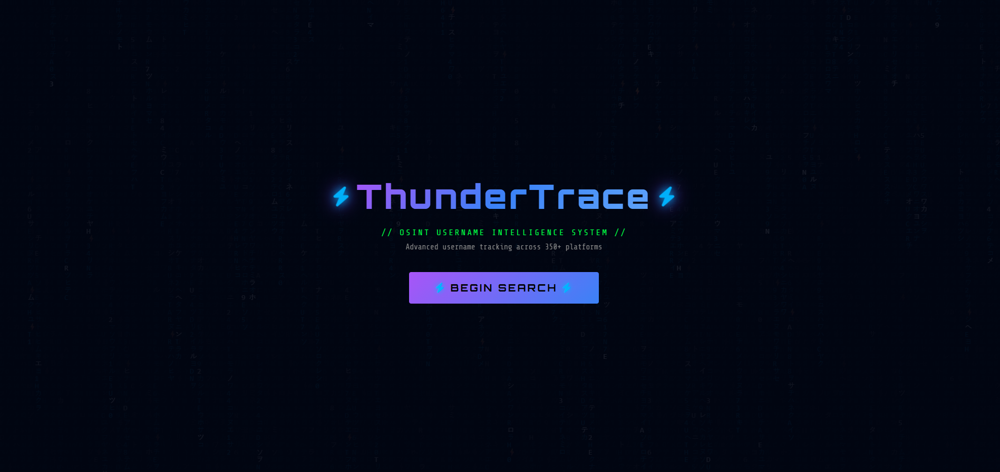
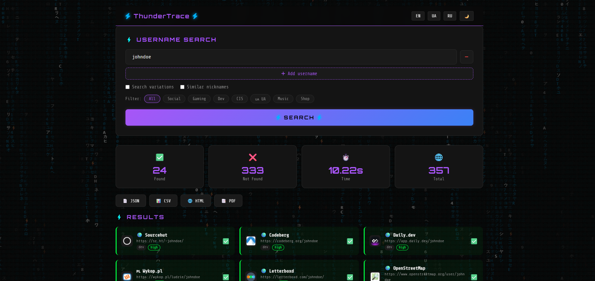
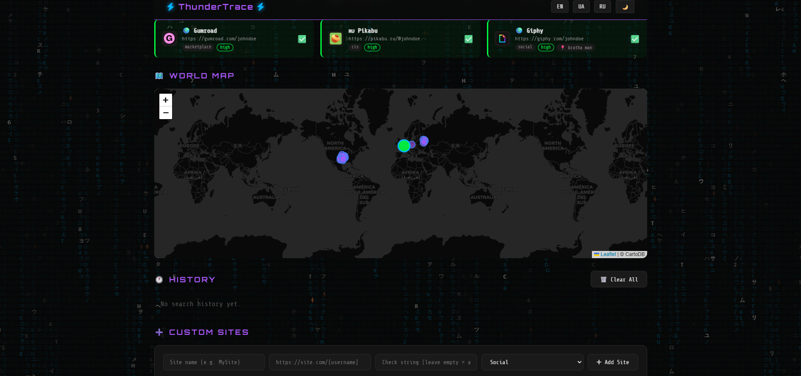

<div align="center">

# ⚡ ThunderTrace

**Advanced OSINT Username Intelligence System**

[](https://python.org)
[](https://flask.palletsprojects.com)
[](LICENSE)
[](data/sites.json)

*Search a username across 350+ platforms in seconds*

</div>

---

## 🔍 What is ThunderTrace?

ThunderTrace is an open-source OSINT tool that lets you track usernames across **350+ platforms** simultaneously — social networks, gaming platforms, developer communities, dating apps, adult content sites, betting platforms, CIS/Ukraine-specific services and more.

Built with a sleek dark cyberpunk UI, real-time progress tracking, and full export support.

---

## ✨ Features

- ⚡ **350+ platforms** — social, gaming, dev, music, design, CIS, Ukraine, 18+, betting, crypto, Asian
- 🔄 **Real-time search** — live progress via WebSockets
- 🎯 **Confidence levels** — High / Medium / Low per result
- 🌍 **World map** — visualize found profiles by country
- 📂 **Export** — JSON, CSV, HTML report, PDF
- 🕐 **Search history** — save and revisit past searches
- ➕ **Custom sites** — add your own platforms to check
- 🔀 **Username variations** — auto-generate and check similar nicknames
- 🌐 **Multilingual** — English, Ukrainian, Russian
- 🌙 **Dark / Light theme** toggle
- 🔔 **Browser notifications** on search complete

---

## 📸 Screenshots

<table>
  <tr>
    <td></td>
    <td></td>
  </tr>
  <tr>
    <td align="center"><i>Welcome screen</i></td>
    <td align="center"><i>Search results</i></td>
  </tr>
  <tr>
    <td colspan="2" align="center"></td>
  </tr>
  <tr>
    <td colspan="2" align="center"><i>Full results view</i></td>
  </tr>
</table>

---

## 🚀 Quick Start

### Requirements

- Python 3.10+
- pip

### Installation

```bash
# 1. Clone the repository
git clone https://github.com/SiLiN-ua/ThunderTrace
cd ThunderTrace

# 2. Install dependencies
pip install -r requirements.txt

# 3. Run
python app.py
```

### Open in browser

```
http://localhost:5000
```

---

## 📦 Dependencies

```
flask
flask-socketio
aiohttp
beautifulsoup4
requests
eventlet
reportlab
Pillow
```

---

## 🗂️ Project Structure

```
ThunderTrace/
├── app.py                 # Flask application & API routes
├── core/
│   └── checker.py         # Async username checker engine
├── data/
│   └── sites.json         # Database of 350+ platforms
├── static/
│   ├── css/style.css      # Cyberpunk UI styles
│   └── js/main.js         # Frontend logic
├── templates/
│   └── index.html         # Main UI template
└── requirements.txt
```

---

## 🌐 Supported Categories

| Category | Platforms |
|----------|-----------|
| 💬 Social | Instagram, Twitter/X, TikTok, Facebook, Reddit, LinkedIn, Telegram, Discord, Snapchat, Threads, and more |
| 🎮 Gaming | Steam, Faceit, Roblox, Chess.com, Xbox, Battle.net, Kongregate, Fortnite Tracker, and more |
| 💻 Dev | GitHub, GitLab, Stack Overflow, HackTheBox, LeetCode, CodePen, and more |
| 🎵 Music | SoundCloud, Spotify, Last.fm, Bandcamp, Mixcloud, and more |
| 🎨 Design | Behance, Dribbble, ArtStation, Figma, Pixiv, and more |
| 🇷🇺 CIS | VK, OK.ru, Habr, Pikabu, Avito, Yandex Zen, and more |
| 🇺🇦 Ukraine | OLX, DOU, Djinni, Monobank, Work.ua, and more |
| 🌏 Asian | Weibo, Bilibili, Naver Blog, NicoNico, Kakao Story |
| 🔞 Adult | OnlyFans, Fansly, Chaturbate, BongaCams, and more |
| 🎰 Betting | 1xBet, Parimatch, Betway, PokerStars, and more |
| 💰 Crypto | Coinbase, OpenSea, Bitcointalk, Mirror.xyz |
| 💘 Dating | Tinder, Badoo, Grindr, OkCupid, Bumble, and more |

---

## ⚙️ How It Works

1. User enters a username
2. ThunderTrace sends async HTTP requests to all 350+ platforms simultaneously
3. Each response is analyzed:
   - **404** → Not found
   - **Username in final URL** → Required check
   - **Not-found strings** check (e.g. "user not found")
   - **Title tag / page text** check for confidence level
4. Results stream in real-time via WebSocket

---

## 📤 Export Formats

| Format | Description |
|--------|-------------|
| `JSON` | Raw data for further processing |
| `CSV` | Spreadsheet-compatible |
| `HTML` | Styled report you can share |
| `PDF` | Print-ready via browser |

---

## ⚠️ Disclaimer

ThunderTrace is intended for **educational and legal OSINT purposes only**.  
Only search for usernames you have permission to investigate.  
The author is not responsible for any misuse of this tool.

---

## 👤 Author

**Yehor Selin (SiLiN)** — [GitHub](https://github.com/SiLiN-ua) | [LinkedIn](https://www.linkedin.com/in/yehor-selin/)

---

<div align="center">

Made with ⚡ and Python

*If you find this useful, give it a ⭐*

</div>